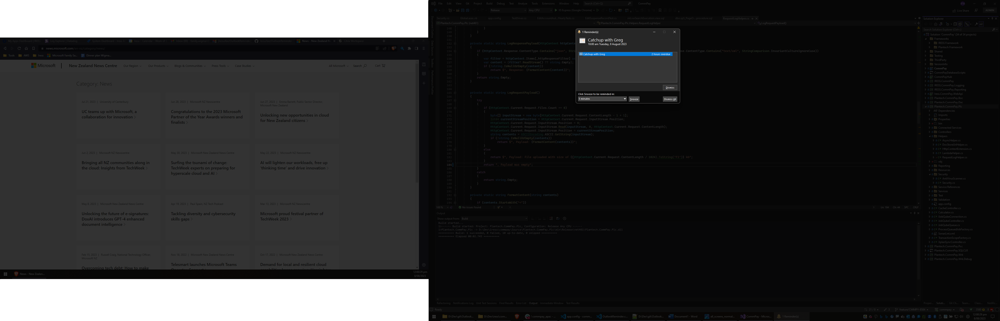

# Outlook Reminder

This application is intended to fix two issues I have had with Outlook since the beginning: 

1. You have to mess around with the Windows Startup folder to get Outlook to start when Windows starts up.
2. Since the introduction of multiple monitors, I occasionally miss the Outlook Reminders.
3. Sometimes I accidently click the close-button of Outlook, and I don't realize this does not just minimize Outlook, but shutsdown the Outlook application. Without any 'are you sure' dialog!

Especially nr. 2 has got me into some problems with important meetings. If you work with multiple monitors, you'll know: sometimes the reminder shows on the screen you're not looking at/working on, and you simply do not notice the Outlook meeting popup! I'm a professional Software developer, but I can't make it to a meeting in time? I was so annoyed I had to explain myself being late, that I decided to fix it.

This program does this: it darkens the screen, except for the outlook reminder, so whereever you're looking at, you'll instantly know there's an Oulook popup!

The screenshot below shows what it looks like. Imagine you're looking at the left screen. When you're focussing on that, there is a good chance you'll NOT notice the little reminder that is popping up over the Visual Studio on the right.

In case you're missing my point about the Outlook popup, this is it:

This tool will make the screens look like this:

## Configuration

When it loads up for the first time, it'll show you the configuration screen, which you can also see when you right-click the icon in the icon-tray on the bottom right.

By default, it will ensure Outlook is started when you login (which only works if you set this tool to start at login in the settings). In case you need to connect to the Office VPN for Outlook to work correctly, you can delay the startup to give your VPN time to connect first.

If you close the settings, it'll minimize to the tray. If you closed down Outlook by accident, the settings will popup, and notify you that it can't find Outlook process that you may have shutdown by accident?

The tool will detect the installation location of Outlook automatically if it's installed in the default folder. In case you decided to change that folder, you can input the location manually.

